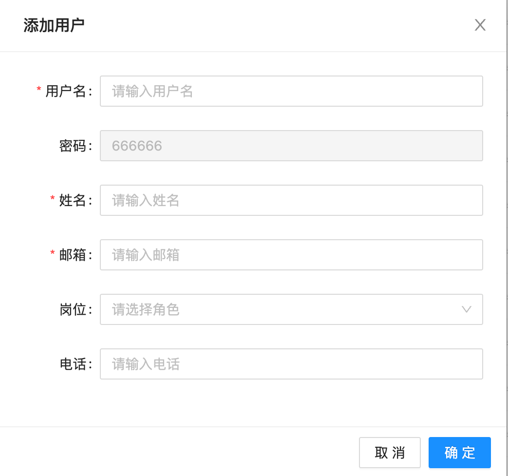
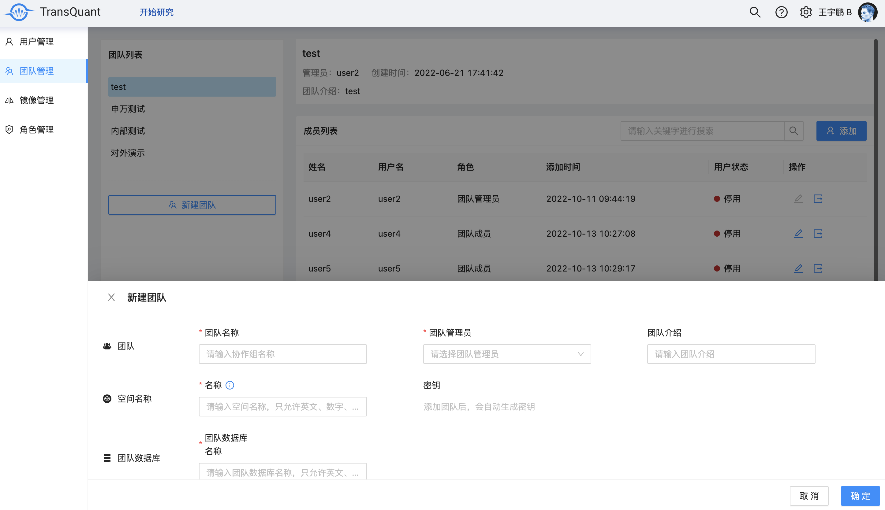
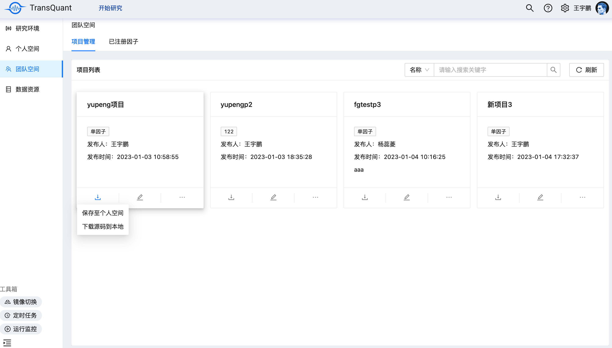
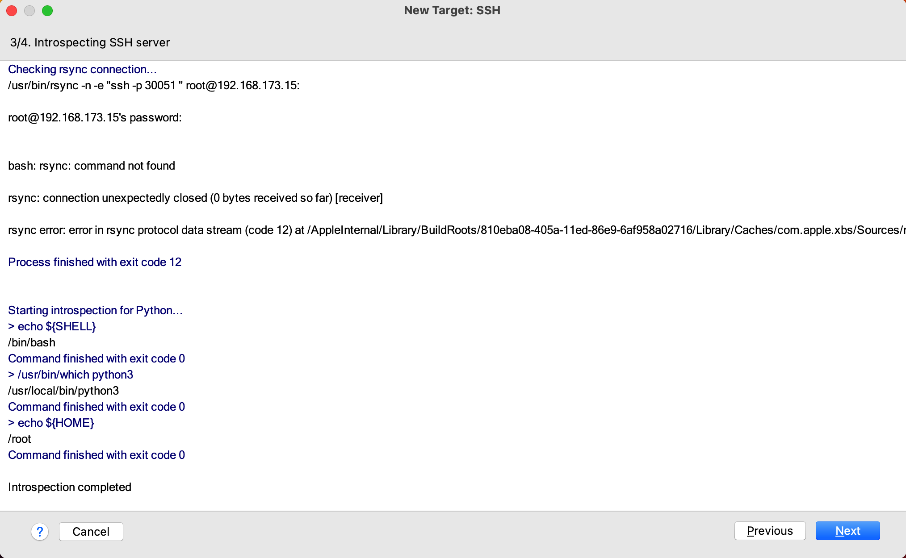
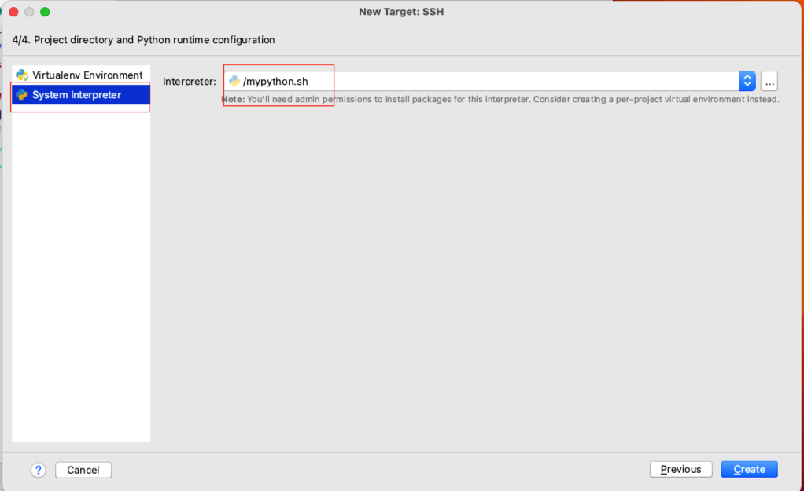
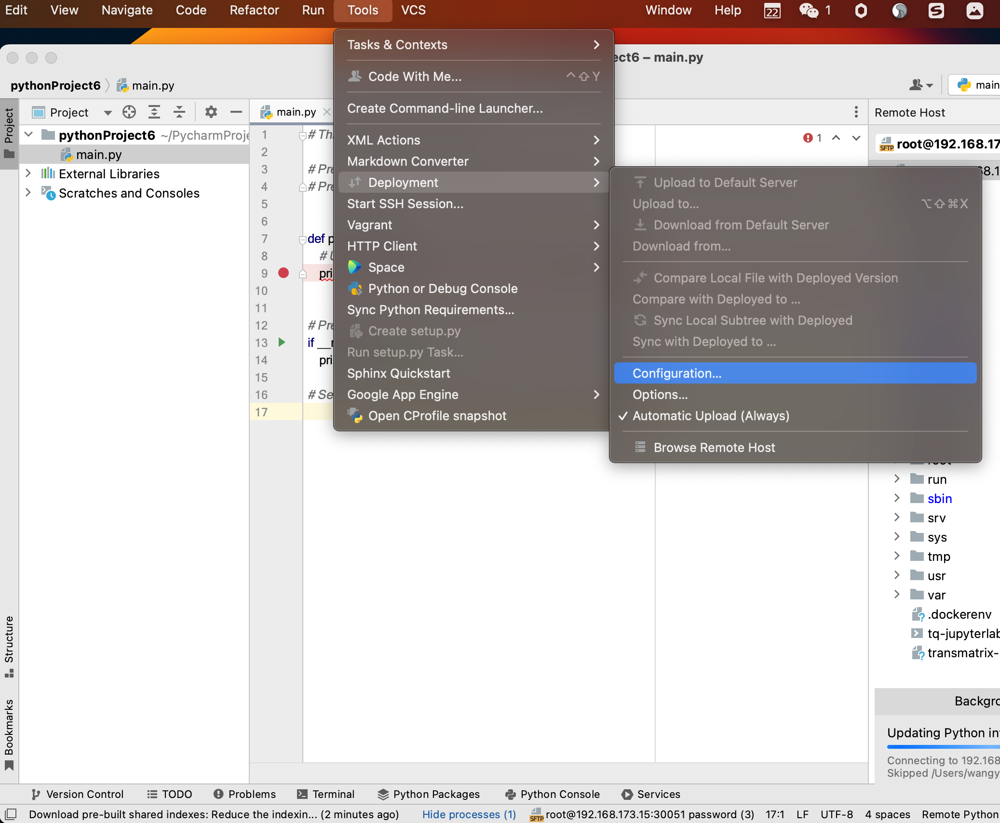
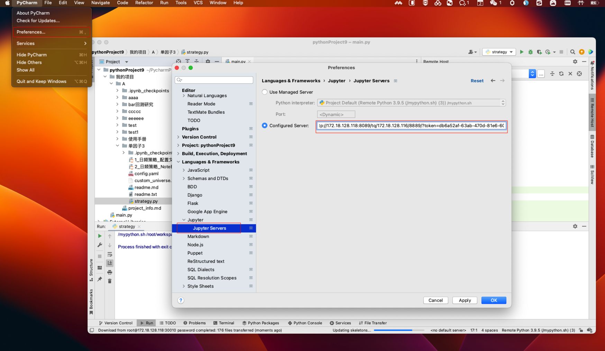

# TransQuant 使用手册 
更新日期：2023 年 2 月 2 日
1. 在个人中心界面添加了【环境固化】和【环境升级】功能，现在可以自助安装 python 包或升级 TransMatrix 至新版本了。参考【三.3.1 个人信息】
2. 在团队管理添加了模版配置功能，现在允许管理员上传或修改本团队成员所使用的模板了。参考【一.1.3.4 修改团队模板】
3. 添加了通过 Pycharm 使用 TransQuant 的链接方式。参考【四.4.1 通过 Pycharm 使用 TransQuant 平台】

# TransQuant 智能量化投研平台的研究模式
TransQuant 智能量化投研平台以项目为单位帮助用户进行量化研究。一个项目可以理解为一个独立的工程目录，TransQuant 提供两种研究模式，signal(因子研究)和 simulation(回测研究)，研究模式通过 yaml 文件中的参数确定。每个项目下都可以存在多个 signal 和 simulation。项目、signal、simulation 在底层都是以文件夹方式存在，用户可以通过前端界面创建，也可以直接在个人文件目录创建(需手动配置 yaml)。TransQuant 建议用户将一个项目目录视为独立目录，项目内不要引用项目外的代码或文件。
# 一、管理中心
## 1.1 用户管理
### 1.1.1 为团队新建一个用户
* 在获得配置的管理员账号之后，可以开始为团队添加新的用户: 
    * 鼠标悬浮在 TransQuant 界面右上角个人头像→点击【管理中心】→找到并点击【用户管理】→点击【添加】


    - 在弹框界面输入对应用户信息，用户名必须为不包含特殊字符的纯字母组合。密码默认为 666666，账号创建成功后，
可在个人中心页面修改密码。点击确认添加该用户。
<div align=center> </div>  

* 点击团队管理界面，选择要将用户加入的团队，点击【添加】将新用户放入该团队→找到刚才新建的用户→赋予相应的角色，每个用户可以拥有多个角色。</br> 角色对应了该用户的权限，具体详情请查看【1.4 角色管理】
* 每个用户只能加入一个团队.

* 返回刚才的用户管理，找到刚才新建立的用户，点击【编辑】→将用户状态修改为【正常】，此时， 新创建的用户就可以正常登录 TransQuant 平台了。

* 接下来对于有代码编辑需求的用户，需要配置相应的研究环境，请参考【1.1.2 为用户配置研究环境】。
### 1.1.2 为用户配置研究环境
* 用户在编辑或运行代码时，需要拥有自己独立的环境资源，如 CPU、GPU、内存等资源，这时可以在【研究环境】中进行配置。  
    * 在【用户管理】界面，找到需要配置环境的用户，点击操作列下的【配置环境】按钮，点击【添加】按钮来为该用户添加一个环境

* 选择需要的镜像→输入自定义的环境名称(实例名称)→填写所需分配的内存、CPU、GPU大小→点击【创建】，此时关闭该界面即可，同时后台就会为该用户创建新的环境，可能需要 2-3 分钟，创建成功或失败后会有相应的提醒
* 如果镜像列表中没有镜像，请先在【镜像管理】中添加好镜像，具体操作请参考【1.2 镜像管理】

## 1.2 镜像管理
* 在【管理中心】界面，在左侧导航栏点击【镜像管理】→点击【添加镜像】→输入自定义的镜像名称→获取的镜像地址(地址请咨询TransQuant团队)→输入对镜像的描述信息→点击右侧操作列中的保存按钮，此时就成功产生一个新的镜像，并可在为用户配置环境时选择该镜像，具体操作请参考【为用户配置研究环境】  


## 1.3 团队管理
### 1.3.1 新建一个团队
* 在【管理中心】界面，在左侧导航栏点击【团队管理】→在界面中点击【添加团队】→输入相应的信息→点击【确认】，此时，新的团队就创建成功了，
之后可以点击界面右侧的【添加】按钮，为团队添加成员，具体操作请参考 【1.1.1 为团队新建用户】

### 1.3.2 添加团队环境
> 环境分为个人环境和团队环境，1.1.2操作指的是为用户个人配置独立的研究环境，团队环境指的是在团队成员将各自的研究成果(回测或者因子)发布至团队空间之后进行运行的环境。团队环境只能由团队管理员和审核员使用，他们将负责维护团队空间中回测和因子的运行。
* 在团队列表中，在需添加团队镜像的团队名称右侧点击配置环境

* 为团队添加所需的环境，流程与 1.1.2 中为个人配置研究环境一致

### 1.3.3 修改团队管理员
* 只有团队管理员才可以对团队进行操作，如需替换团队管理员，可以点击团队列表中目标团队右侧的编辑按钮，在弹窗中修改团队管理员

### 1.3.4 修改团队模板
* 团队管理员可以修改团队成员所使用的模版，点击配置模版

* 在弹窗中添加或删除已有的模版，模版类型分为 signal、simulation、和项目
* 注意上传的模版文件推荐使用通过 GBK 编码的 .zip 压缩文件
    * signal 模板：在个人空间某项目中创建研究文件夹时可以选择，对应的 yaml 中 的模式为 signal，请直接压缩模板源文件，请勿将源文件放入文件夹后再压缩
    * simulation 模板：在个人空间某项目中创建研究文件夹时可以选择，对应的 yaml 中 的模式为 simulation，请直接压缩模板源文件，请勿将源文件放入文件夹后再压缩
    * 项目：在个人空创建项目时可以选择，项目模版中可以包含多个研究文件夹


## 1.4 角色管理
> 用户的角色决定了该用户能够访问的页面功能，如用户管理员可以访问用户管理和镜像管理页面。
* 在【管理中心】界面，在左侧导航栏点击【角色管理】，在角色列表中点击任意角色，可以在右侧查看该角色具备的页面权限。

# 二、开始研究
## 2.1 个人空间
> 用户的个人空间是用户私人的、独立的一片空间，在空间内可以创建项目，每个项目在目录中是一个文件夹，项目可以理解为用户进行一个独立研究的工程目录。TransQuant 建议用户将项目视为独立的、封闭的研究目录，项目内的文件不要引用项目外或其他项目的文件。
### 2.1.1 新建一个项目并创建策略
> 每个项目下可以创建多个因子或回测，项目内的代码文件可以互相引用。每个回测或因子在目录中是一个文件夹(以signal或simulation的 yaml 文件为准)，TransQuant 建议用户在编辑代码文件中也遵守此规则。
* 在【个人空间】界面找到项目管理→点击【新建】→输入对应的信息→点击【确定】→点击打开刚才新创建的项目
* 如果选择某个项目模版，TransQuant 会自动在该项目下创建模版所包含的回测或因子。

* 在项目页面内点击【新建】创建一个新的研究文件，输入名称并选择一个模板，如果需要马上编写代码，可点击【保存并打开文件】前往研究环境界面进行研究即可。此时一个新的策略组合就创建好了，可点击操作项目下的文件夹图标跳转至代码编辑界面，使用 IDE 的用户可直接在新创建的研究文件夹下面编辑代码。

* 对于已经有回测结果或因子检验结果的研究文件，可以点击操作栏下的【查看详情】图标，查看可视化结果

### 2.1.2 发布项目到团队空间
> 用户可以将自己的研究项目从个人空间发布到团队空间，并选择对谁可见，这样可以让团队其他成员查看该用户的研究成果。发布时可以发布自己的项目文件和数据，在审核员进行审核通过之后就可以在团队空间中看到发布的项目了。
* 找到需要发布的项目→点击操作栏下的【发布】

* 填写相关信息，选择对谁可见，勾选需发布的数据和源码文件夹，点击【提交】，此时就进入到审批环节了。

* 发布审批管理请参考【3.1 发布管理】
* 团队空间空间请参考【2.3 团队空间】 
## 2.3 团队空间
> 团队空间和个人空间十分相似，可以查看团队成员发布的项目，点开后也可以看到项目内的回测或因子。
* 用户在团队空间中可以下载某项目的源码。
    * 【保存至个人空间】：用户可以直接在个人空间中创建一个相同项目
    * 【下载源码至本地】：直接下载该项目源码到本地
* 只有团队管理员和审核员能够使用团队环境，能够直接打开团队项目或研究文件夹进行代码编辑
    * 点击镜像切换可以查看是否有团队环境
 
   
## 2.4 数据资源
> 数据资源展示了用户有读取权限的所有数据库及数据表。每个用户都有三块空间：公共资源、个人空间、团队空间。</br> 公共资源：以整个 TransQaunt 平台为单位，所有团队都可以访问的数据，通常会存放一些基础数据，如行情数据、基本面数据等，供所有用户研究使用。</br> 个人空间：每个用户都有自己私人的、独立的个人空间，用来存放用户在研究过程中保存的数据，以单个用户为单位，不同用户间的个人空间是隔离的，通常会存放用户个人产生的因子数据等。</br> 团队空间: 以一个团队为单位，团队用户发布的数据资产及团队级别通用的数据都可以存放在这里，不同团队间的数据是隔离的。
* 在开始研究界面，点击左侧的数据资源，即可查看用户能够读取的所有数据，可以在顶部搜索栏进行搜索来查找所需的数据。
    * 名称搜索：输入数据表的关键字，可以筛选出携带该关键字的表名称
    * 标签搜索：输入标签，可以筛选出携带该标签的数据表
* 点击具体的某张数据表，即可在右侧查看该表的数据详情，并且可以根据喜好为数据表设置标签
 
## 2.5 工具栏
> 工具栏提供了用户在研究过程中所涉及的常用工具，包含镜像切换、定时任务、运行监控三种工具。
### 2.5.1 镜像切换
* 如果一个用户有多个镜像，可以在开始研究界面左下角工具栏内点击镜像切换，切换到需要使用的镜像，对于常用的镜像设置为默认。镜像类别分为个人镜像和团队镜像，团队镜像对应团队空间的项目环境，只有团队管理员或审核员可以使用。

### 2.5.2 定时任务
> 定时任务模块可以定时定频执行目标文件，通常当用户需要定时定频的对单个或者多个因子进行更新时，可以使用该功能。
* 当用户在 yaml 文件内配置好定时任务所需的各项参数后，在工具箱内点击打开定时任务模块。点击后会出现新的登录界面，此时使用自己的用户名密码即可。
* 登录后点击左侧的任务管理，选择执行器，在下拉框中选择需要的环境即可，再点击新增。
    * 执行器：选择任务运行的镜像，可在 TQ 切换镜像中查看
    * 负责人：按需填写
    * 任务描述：按需填写
    * 调度配置：CRON
    * Cron：配置运行频率和时间
    * 任务参数：输入需定时定频执行文件所在地址，一般为`/root/workspace/我的项目/(项目名称)/xxxx/执行文件.yaml`
    * 天数：注意图中在任务参数的地址后添加了`,(天数)`，天数参数被用做动态指定开始日期，比如今天是 2023 年 1 月 28 日，天数参数配置为 10 ，每日执行一次回测，则今天回测的开始日期为 1 月 18 日，明天回测的开始日期则变为 1 月 19 日，以此类推。


* 点击保存，打开操作栏，点击 GLUE IDE。

* 将以下代码粘贴进编辑器中。
    * 以下代码中配置了文件定时定频运行时的时间参数：startDate(开始日期) 和 endDate（截止日期)。
    * startDate(开始日期)：开始日期是动态的，使用当天日期-（天数)作为开始日期。
    * endDate：可使用当前日期或指定日期作为截止日期，用户可自行调整相关代码。

```
echo "xxl-job: hello shell"

echo "脚本位置：$0"
echo "参数：$1"

params=(${1//,/ })


echo "参数:${params[0]}"
echo "参数:${params[1]}"

path=${params[0]}
days=${params[1]}

startDate=`date -d"-$days day" +"%Y%m%d"` 
##无最新数据，暂时使用固定结束日期
#endDate=$(date '+%Y%m%d')
endDate='20211230'


echo "开始时间:$startDate"
echo "结束时间:$endDate"

echo "BatchMatrix -p $path -s $startDate-$endDate "
BatchMatrix -p $path -s $startDate-$endDate

echo "运行结束"
exit 0
```

* 配置完成后点击保存，然后在操作项下点击执行一次进行检查，或直接启动。

* 在左侧点击调度日志，选择执行器，点击搜索，查看调度结果和执行结果是否成功。也可以点击操作下的执行日志查看返回的执行结果。如果没有问题，则可以在任务管理中启动该任务，使任务定时定频运行。

### 2.5.3 运行监控
* 当用户在 yaml 内设置`logging: True`时，运行监控模块则可以监控该 yaml 任务的执行情况。

* 点击左下角工具箱中的运行监控，打开后可以查看运行记录，在操作栏下可以点击查看某项任务的运行日志。


---
# 三、个人中心
## 3.1 个人信息
* 用户可以在个人信息界面查看自己的用户信息和环境信息，点击修改密码可以对用户密码进行修改。
 
* 环境固化：如果您自行在环境中安装了一些Python包，可以使用该操作固化您的环境，使这些Python包永久存在于您的环境中。
* 环境升级：当 TransMatrix 有新的版本时，您可以通过该操作升级您的环境至最新TransMatrix版本，您自行安装的Python包升级后也会保留。

## 3.2 发布管理
### 3.2.1 查看自己的发布
* 鼠标悬浮至右上角的角色头像→点击【个人中心】→点击【发布管理】→可以找到自己提交的发布
  
* 点击需要查看的工单，进入工单详情页面，此时可以下载关联文件，查看回测结果或因子检验详情等信息
  
* 如果该工单被驳回了，可以在右上角点击【重新提交】  
 
* 在工单详情界面，可以将发布的项目保存下来
    * 【保存至个人空间】：用户可以直接在个人空间中创建一个相同项目
    * 【下载源码至本地】：直接下载该项目源码到本地
 
### 3.2.2 对发布进行审批  
> 审核员可以在发布管理界面对团队成员发布的项目进行审批，点击【发布管理】-【我审核的】即可查看审核的工单列表。
* 在发布管理界面中选择【我审核的】，并点击需要进行审核的工单。
    
* 此时审核员可以下载源码进行检查，也可以点击数据资产 tab 查看发布人所发布的数据。
  
* 在审核完成后，点击【驳回】或者【通过】。
    
* 如果需要驳回，可选择填写驳回的原因。
    
* 如点击通过，首先会再次确认需发布到团队空间的数据资产，如果某个数据表有红色感叹号标记，说明该表名在团队数据库中已被占用，此时可以对表名进行修改，修改完表名后，可点击下一步再次检查是否有表名冲突，如果没有冲突会提示修改成功。
  
* 确认完数据资产之后，需确认项目可见权限、项目名称、标签等信息，可以跳过这一步，也可以点击确认。
    * 跳过：不在团队空间新建该项目，由审核员手动对已有的项目文件进行修改，适用于对已有项目的维护更新。
    * 确认：将在团队空间新建该项目，适用于新项目，点击确认后，就可以在团队空间查看该项目了。
 
## 3.3 标签管理
* 用户可以在个人空间、团队空间、数据资源、以及研究文件相关界面设置标签，之后可以在个人中心内的标签管理界面对标签进行管理。可以对已有标签进行修改或直接删除，操作后即时生效。
  
---
# 四、其他
## 4.1 通过 Pycharm 使用 TransQuant 平台
> 用户可以通过配置Pycharm中ssh连接的interpreter来使用TransQuant平台
1. 打开 Pycharm，在 Projects 中新建一个项目

2. 在新界面中，展开 Python Interpreter，点击添加 Interpreter，选择 On SSH。


3. 此时需要填写 SSH 连接信息。在 TransQuant 平台界面中点击右上角个人头像，选择个人中心。

4. 选择需要通过 Pycharm 连接的环境，将该环境中的IP和端口等信息填入 Pycharm 的连接信息中，点击下一步。
* 如果TransQuant 部署的服务器需通过代理服务器访问，请使用代理端口访问。


5. 输入用户的密码，点击下一步。

6. 等待 Pycharm 连接完成，点击下一步。

7. 在 System Interpreter 中配置需同步的目录，此时请选择 `/mypython.sh` 点击创建。


8. 通常情况下 Pycharm 会进行同步文件行为，让 Pycharm 自行完成即可。

9. 打开Tools-Deployment-Configure，配置**Mapping**后，本地写的代码，才可以上传到远程环境，进行运行或调试。在左侧列表中选择刚才连接的 IP 地址，在右侧 Mapping 菜单中的 Deployment path 中选择`/root/workspace`目录


10. 打开Tools-Deployment-Browse Remote Host，等待索引创建完毕。然后打开`/root/workspace`，选择需要同步的目录，邮件点击，然后点击 Download from here。待下载完成后，左侧目录就会出现下载好的目录文件。


11. 打开 pycharm设置，找到 Jupyter Servers，选择 Configured Server，将个人信息中对应环境地址的Jupyter Server 地址粘贴Configured Server 中，点击确认

* 此时 Pycharm连接便配置完成了。
